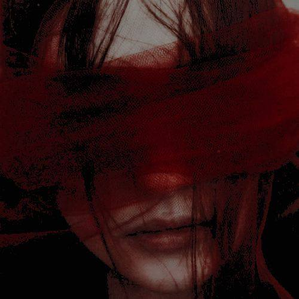

<!DOCTYPE html>
<html lang="en">
<head>
    <meta charset="UTF-8">
    <meta name="viewport" content="width=device-width, initial-scale=1.0">
    <title>Document</title>
<link rel="stylesheet" href="style.css">
<meta name="viewport" content="width=device-width, initial-scale=1.0">

</head>

<body>
    

  

    

      
    

<h1>
    Эпилог: Рассвет Глаза
</h1>

<box2>

   Тихий стон, едва слышный над гулом вечно бодрствующего Токио, стал предвестником конца. Он начался как шепот, незаметно, в самом сердце мегаполиса, но вскоре превратился в рев, пожирающий все на своем пути. Неизвестный вирус, чуждая зараза, вырвался на свободу, и его распространение было ужасающим, беспощадным в своей эффективности.

Жертвы. 

Сперва их называли так.

Люди, на чьих лбах проступала таинственная метка - глаз, словно нарисованный чьей-то невидимой, зловещей кистью. Они не знали, что это не симптом, а клеймо, предвещающее неизбежное. Ибо вскоре, по прошествии краткого, мучительного срока, эти несчастные превращались. Превращались в Проклятия, чудовищные воплощения зла, обреченные разрушать тот мир, что когда-то был им домом.

Истина была проста и отвратительна: заразиться можно было лишь одним способом. Если хотя бы капля крови уже обращенного духа-проклятия, несущего на лбу печать глаза, попадала на человека, его судьба была предрешена. Никто не знал, что делать. Паника охватила улицы, сменяя беспокойство на звериный страх. Каждый пытался спастись, спрятаться, выжить любой ценой. И вскоре Токио, а за ним и весь мир, стали местом, где люди избегали друг друга, как чумы. Эта волна негативных эмоций, этот прилив ужаса и отчаяния, лишь подпитывал неведомую силу, умножая число проклятий и делая каждое новое существо сильнее предыдущего, кошмарнее и безжалостнее. 

    В мире шаманов, хранителей баланса, наступил хаос. Многие из них, сражаясь на передовой этой незримой, но смертоносной войны, не выживали. Их последние, отчаянные схватки оборачивались для них не гибелью, но еще более страшной участью: они сами становились чудовищами, искаженными подобиями своих прежних тел, разрушающими привычный мир с удвоенной яростью. Сон стал роскошью, еда — забытой необходимостью. Младшие шаманы падали от изнеможения, едва выдавалась секунда покоя, тогда как самые могущественные воины не находили времени даже на вдох, без устали изгоняя и уничтожая нескончаемый поток проклятий.

Казалось бы, для тех Проклятых Духов, что зародились задолго до этой напасти, наступили золотые времена. Если бы все шло такими темпами, человечество неминуемо вымерло бы, оставив лишь единицы, низведенные до рабского состояния, служащие безликой массе чудовищ и порождающие все новые и новые воплощения зла. Но новая, вирусная зараза, изменила даже этот древний порядок. Проклятые Духи, появившиеся на свет благодаря вирусу, относились к "старым" проклятиям с не меньшей агрессией, пытаясь низвергнуть их с "престола", который те занимали тысячелетиями.

Это стало последней каплей. Древние, могущественные проклятые духи, привыкшие к своему доминированию, взорвались яростью. Они начали уничтожать своих новых конкурентов, не гнушаясь ради этого пойти на невиданный прежде шаг - временное сотрудничество с шаманами. Однако взаимная ненависть, глубоко укоренившаяся в веках, не могла уйти так просто, и такие союзы были хрупкими, опасными и полными недоверия.

    Вирус не поддавался лечению. Никакие известные магические техники не могли остановить его распространение или обратить вспять трансформацию. Число проклятий росло в геометрической прогрессии, и с каждым днем становилось все очевиднее, что это не просто болезнь, а чья-то проклятая техника, чья-то злая воля. Подозрения пали на некое незарегистрированное Проклятие класса «Болезни» - сущность, чей след оставался неуловимым. И теперь все оставшиеся силы - шаманы, и даже некоторые древние духи - были брошены на его поиски.

Но удастся ли им отыскать и уничтожить источник этого кошмара, прежде чем весь мир погрузится в вечную ночь, где единственным светом будет зловещее мерцание глаз на лбу каждого чудовища?

</box2>

    </plot>

</body>

<button id="toptop">↑</button>
<button id="BOT">

<a href="https://t.me/VirusChroniclesBot" target="_blank" class="tg-btn">
  бот
</a>

</button>
</html>
document.addEventListener("DOMContentLoaded", function() {
    const btn = document.getElementById("toptop"); 

    // Проверка на случай, если id в HTML написан иначе
    if (!btn) return;

    window.addEventListener("scroll", function() { 
        if (window.scrollY > 300) { 
            btn.style.display = "block"; 
        } else { 
            // 2. ОБЯЗАТЕЛЬНО добавляем скрытие, чтобы кнопка исчезала
            btn.style.display = "none"; 
        } 
    }); 

    btn.addEventListener("click", function() { 
        window.scrollTo({ 
            top: 0, 
            behavior: "smooth" // Плавная прокрутка
        }); 
    });
});

document.addEventListener("DOMContentLoaded", function () {

   
    const bot = document.getElementById("BOT");

    window.addEventListener("scroll", function () {

        // КНОПКА появляется после 300px
        if (window.scrollY > 300) {
            bot.classList.add("show");
        } else {
            bot.classList.remove("show");
        }

      
    });

});

function checkScroll() {
    const elements = document.querySelectorAll("box2");

    elements.forEach(el => {
        const rect = el.getBoundingClientRect();
        const windowHeight = window.innerHeight;

        // Если элемент виден на экране — показываем
        if (rect.top < windowHeight - 100 && rect.bottom > 0) {
            // Добавляем пульсацию только если ещё не было visible
            if (!el.classList.contains("visible")) {
                el.classList.add("visible");
            }
        } else {
            // Элемент ушёл за экран — скрываем
            el.classList.remove("visible");
        }
    });
}

// События: при загрузке страницы и при скролле
window.addEventListener("scroll", checkScroll);
window.addEventListener("load", checkScroll);
@import url('https://fonts.googleapis.com/css2?family=Playwrite+AT:ital,wght@0,100..400;1,100..400&family=Playwrite+NZ+Basic:wght@100..400&display=swap');
@import url('https://fonts.googleapis.com/css2?family=Playwrite+AT:ital,wght@0,100..400;1,100..400&family=Playwrite+NZ+Basic:wght@100..400&family=Roboto:ital,wght@0,100..900;1,100..900&display=swap');

* {
  margin: 0;
  padding: 0;
  box-sizing: border-box;
}
body {
  font-family: 'Segoe UI', sans-serif;
  background: #0f0f0f;
  color: #eaeaea;
    align-items: center;
}

/* Центрирование */
.container {
  max-width: 1200px;
  margin: 60px auto;
  padding: 20px;
    align-items: center;
}

/* Две колонки */
.content {
  display: grid;
  grid-template-columns: 1fr 1fr;
  gap: 50px;
  align-items: center;
}

/* Картинка */
.image img {
  width: 100%;
  border-radius: 20px;
  box-shadow: 0 20px 50px rgba(0,0,0,0.6);
}

/* Текст */

  body {
  font-family: 'Segoe UI', sans-serif;
  background: #0f0f0f;
  color: #eaeaea;
    align-items: center;
   
}

box2{
  display: block;
  opacity: 0;
  transform: translateY(50px);
  transition: opacity 1.2s ease-out, transform 1.2s ease-out;
}

box2 h2 {
  font-size: 32px;
  margin-bottom: 25px;
  
}

box2 p {
  margin-bottom: 20px;
  font-size: 18px;
  color: #ccc;
  display: flex;
  flex-direction: column;
  margin: 0;
  font-size: 1.2em;
}

@media (max-width: 900px) {
  .content {
    grid-template-columns: 1fr;
  }

  box2 h2 {
    font-size: 24px;
  }

  box2 p {
    font-size: 16px;
    text-align: right;
  }
}

#toptop {
  position: fixed;
  bottom: 25px;
  right: 25px;

  width: 55px;
  height: 55px;

  border-radius: 50%;
  border: none;

  background-color: #1f1f1f;
  color: white;
  font-size: 22px;

  display: flex;
  align-items: center;
  justify-content: center;

  cursor: pointer;
  z-index: 999;

  box-shadow: 0 8px 20px rgba(0, 0, 0, 0.4);
  transition: all 0.3s ease;
}

/* При наведении */
#toptop:hover {
  background-color: #6a00ff;
  transform: translateY(-3px);
}
#BOT{
 position: fixed;
  left: 25;
bottom: 25px;
  width: 40px;
  height: 40px;

  background-color: #1f1f1f;
  color: white;
  font-size: 22px;

  display: flex;
  align-items: center;
  justify-content: center;

  cursor: pointer;
  z-index: 999;

  box-shadow: 0 8px 20px rgba(0, 0, 0, 0.4);
  transition: all 0.3s ease;

}

.tg-btn{
background-color: #ff4d6d;
color: wheat;
padding: 12px 24px;
border-radius: 30px;
font-weight: bold;
transition: 0.3s;
animation: pulse 1.5 infinite;

}

.tg-btn:hover{
background-color: #e63950;
transform: scale(1.08);
}

a{
color: #ccc;
font-size: 14px;
text-decoration: none;
font-family: Robotoital;
}
@keyframes pulse {
  0% { box-shadow: 0 0 0 0 rgba (255, 77, 109, 0.6);}
  70% {box-shadow: 0 0 0 15px rgba(255, 77, 109, 0);}
  100% {box-shadow: 0 0 0 0 rgba(255, 77, 109, 0);}

  
}

box2 {
    display: block;
    opacity: 0;
    transform: translateY(50px);
    transition: opacity 1.2s ease-out, transform 1.2s ease-out;
}

box2.visible {
    opacity: 1;
    transform: translateY(0);
    animation: pulse 0.6s ease-in-out 1; /* мягкая пульсация один раз */
}

@keyframes pulse {
    0%   { transform: translateY(0) scale(0.97); }
    50%  { transform: translateY(0) scale(1.03); }
    100% { transform: translateY(0) scale(1); }
}

#BOT {
    opacity: 0;
    transition: opacity 0.5s ease;
}

#BOT.show {
    opacity: 1;
}
